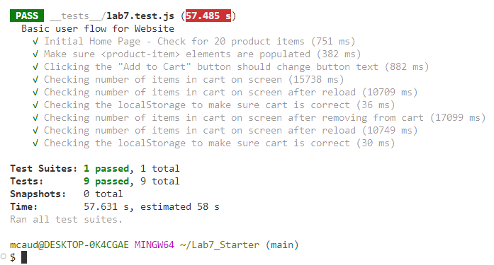

### Names: Audrey Elizabeth Fernandez (solo)

## Check Your Understanding

### 1. Where would you fit your automated tests in your Recipe project development pipeline?  

You'd fit automated tests in a GitHub action so that it runs the tests whenever code is pushed and only code that passes all the tests can be merged to the main branch

### 2. Would you use an end-to-end test to check if a function is returning the correct output?  

No because end-tp-end tests are for simulating user interactions as it relates to the UI. 

### 3. What is the difference between navigation and snapshot mode in Lighthouse?  

Navigation mode will load the page from the beginning and will record performance whereas snapshot mode records the page's current status and will not reresh it

### 4. Name three things we could do to improve the CSE 110 shop site based on the Lighthouse results  

- make images more accessible by putting descriptive alt text
- make the images load faster to speed up the pages
- reduce the amount of code running at once

